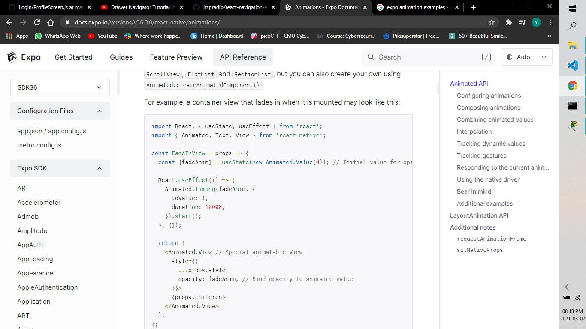

# Animation

Animations are very important to create a great user experience. Stationary objects must overcome inertia as they start moving. Objects in motion have momentum and rarely come to a stop immediately. Animations allow you to convey physically believable motion in your interface.

In React-native provides animation system : `Animated` for granular and interactive control of specific values, and `LayoutAnimation ` for animated global layout transactions.

## Animated API

Animated focuses on declarative relationships between inputs and outputs, with configurable transforms in between, and start/stop methods to control time-based animation execution.

Animated exports six animatable component types: View, Text, Image, ScrollView, FlatList and SectionList, but you can also create your own using Animated.createAnimatedComponent().

**Configuring animations**
Animated provides three types of animation types. Each animation type provides a particular animation curve that controls how your values animate from their initial value to the final value:

- Animated.decay() starts with an initial velocity and gradually slows to a stop.
- Animated.spring() provides a basic spring physics model.
- Animated.timing() animates a value over time using easing functions.

In most cases, you will be using timing(). By default, it uses a symmetric easeInOut curve that conveys the gradual acceleration of an object to full speed and concludes by gradually decelerating to a stop.

**Working with animation**
Animations are started by calling start() on your animation. start() takes a completion callback that will be called when the animation is done. If the animation finished running normally, the completion callback will be invoked with {finished: true}. If the animation is done because stop() was called on it before it could finish (e.g. because it was interrupted by a gesture or another animation), then it will receive {finished: false}.

**Animatable Components**
Only animatable components can be animated. These unique components do the magic of binding the animated values to the properties, and do targeted native updates to avoid the cost of the react render and reconciliation process on every frame. They also handle cleanup on unmount so they are safe by default.

- createAnimatedComponent() can be used to make a component animatable.
  Animated exports the following animatable components using the above wrapper:
- Animated.Image
- Animated.ScrollView
- Animated.Text
- Animated.View
- Animated.FlatList
- Animated.SectionList

**Composing animations**
Animations can also be combined in complex ways using composition functions:

- Animated.delay() starts an animation after a given delay.
- Animated.parallel() starts a number of animations at the same time.
- Animated.sequence() starts the animations in order, waiting for each to complete before starting the next.
- Animated.stagger() starts animations in order and in parallel, but with successive delays.

Animations can also be chained together by setting the toValue of one animation to be another Animated.Value. See Tracking dynamic values in the Animations guide.
By default, if one animation is stopped or interrupted, then all other animations in the group are also stopped.

**Combining animated values**
You can combine two animated values via addition, subtraction, multiplication, division, or modulo to make a new animated value:

- Animated.add()
- Animated.subtract()
- Animated.divide()
- Animated.modulo()
- Animated.multiply()

There are more methods to implement animation in React-native. Like `react-native-animatable` and more.
