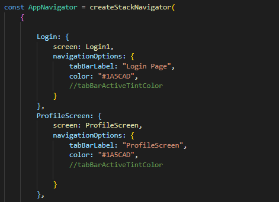

# Navigation in React-Native(All for v5)

React Navigation is a popular library for routing and navigation in a React Native application.

This library helps solve the problem of navigating between multiple screens and sharing data between them.

## StackNavigation

For navigating between screens, you will use a StackNavigator. A StackNavigator works exactly like a call stack. Each screen you navigate to is pushed to the top of the stack. Each time you hit the back button, the screens pop off the top of the stack.

**Installation** :

1.  Install @react-navigation/native:

    `npm install @react-navigation/native`

2.  Install @react-navigation/stack and its peer dependencies:

    `npm install @react-navigation/stack @react-native-community/masked-view react-native-screens react-native-safe-area-context react-native-gesture-handler`

3.  Add NavigationContainer and createStackNavigation to your Ap.js :
    `import { NavigationContainer } from '@react-navigation/native'; import { createStackNavigator } from '@react-navigation/stack';`
    Inside createStackNavigation you should define your Screens with the screen name like:

    

**Creating a Stack Navigator**
CreateStackNavigator is a function that returns an object containing 2 properties: Screen and Navigator. Both of them are React components used for configuring the navigator. The Navigator should contain Screen elements as its children to define the configuration for routes.

NavigationContainer is a component which manages our navigation tree and contains the navigation state. This component must wrap all navigators structure. Usually, we'd render this component at the root of our app, which is usually the component exported from App.js

    ```
    import \* as React from 'react';
    import { NavigationContainer } from '@react-navigation/native';
    import { createStackNavigator } from '@react-navigation/stack';
    function App() {
    return (

                    <NavigationContainer>
                    <Stack.Navigator>
                        <Stack.Screen name="Home" component={HomeScreen} />
                    </Stack.Navigator>
                    </NavigationContainer>
                );
                }

                export default App;
    ```

**Configuring the Navigator**

All of the route configuration is specified as props to our navigator. We haven't passed any props to our navigator, so it just uses the default configuration.

## Tab Navigation

The most common style of navigation in mobile apps is tab-based navigation. This can be tabs on the bottom of the screen or on the top below the header (or even instead of a header).

This guide covers createBottomTabNavigator. You may also use createMaterialBottomTabNavigator and createMaterialTopTabNavigator to add tabs to your application.

**Installation**
`npm install @react-navigation/bottom-tabs `

**Sample-code for Tab-based Navigation**

    ```
    import \* as React from 'react';
    import { Text, View } from 'react-native';
    import { NavigationContainer } from '@react-navigation/native';
    import { createBottomTabNavigator } from '@react-navigation/bottom-tabs';

    function HomeScreen() {
    return (
    <View style={{ flex: 1, justifyContent: 'center', alignItems: 'center' }}>
    <Text>Home!</Text>
    </View>
    );
    }

    function SettingsScreen() {
    return (
    <View style={{ flex: 1, justifyContent: 'center', alignItems: 'center' }}>
    <Text>Settings!</Text>
    </View>
    );
    }

    const Tab = createBottomTabNavigator();

    export default function App() {
    return (
    <NavigationContainer>
    <Tab.Navigator>
    <Tab.Screen name="Home" component={HomeScreen} />
    <Tab.Screen name="Settings" component={SettingsScreen} />
    </Tab.Navigator>
    </NavigationContainer>
    );
    }
    ```

## Drawer Navigation

Common pattern in navigation is to use drawer from left (sometimes right) side for navigating between screens.

**Installation**
`npm install @react-navigation/drawer`

**Sample-code for Drawer Navigation**

    ```
    import * as React from 'react';
    import { Button, View } from 'react-native';
    import { createDrawerNavigator } from '@react-navigation/drawer';
    import { NavigationContainer } from '@react-navigation/native';

    function HomeScreen({ navigation }) {
    return (
        <View style={{ flex: 1, alignItems: 'center', justifyContent: 'center' }}>
        <Button
            onPress={() => navigation.navigate('Notifications')}
            title="Go to notifications"
        />
        </View>
    );
    }

    function NotificationsScreen({ navigation }) {
    return (
        <View style={{ flex: 1, alignItems: 'center', justifyContent: 'center' }}>
        <Button onPress={() => navigation.goBack()} title="Go back home" />
        </View>
    );
    }

    const Drawer = createDrawerNavigator();

    export default function App() {
    return (
        <NavigationContainer>
        <Drawer.Navigator initialRouteName="Home">
            <Drawer.Screen name="Home" component={HomeScreen} />
            <Drawer.Screen name="Notifications" component={NotificationsScreen} />
        </Drawer.Navigator>
        </NavigationContainer>
    );
    }
    ```

**Opening & Closing of Drawer**
To achieve open and close drawer, following should be used:

- navigation.openDrawer(); -- for open the drawer.
- navigation.closeDrawer(); -- for closing the drawer.

**Toggle in Drawer**

- navigation.toggleDrawer();

Each of these functions, behind the scenes, are simply dispatching actions:

- navigation.dispatch(DrawerActions.openDrawer());
- navigation.dispatch(DrawerActions.closeDrawer());
- navigation.dispatch(DrawerActions.toggleDrawer());

For more special UI Experencie we can go with `createMaterialBottomTabNavigator`. All the procedures are same rather we have to install `npm install @react-navigation/material-bottom-tabs react-native-paper`. And Declare the function as:

    ```
    import { createMaterialBottomTabNavigator } from '@react-navigation/material-bottom-tabs';

    const Tab = createMaterialBottomTabNavigator();

    function MyTabs() {
    return (
        <Tab.Navigator>
        <Tab.Screen name="Home" component={HomeScreen} />
        <Tab.Screen name="Settings" component={SettingsScreen} />
        </Tab.Navigator>
    );
    }
    ```

Thanks for reading.
